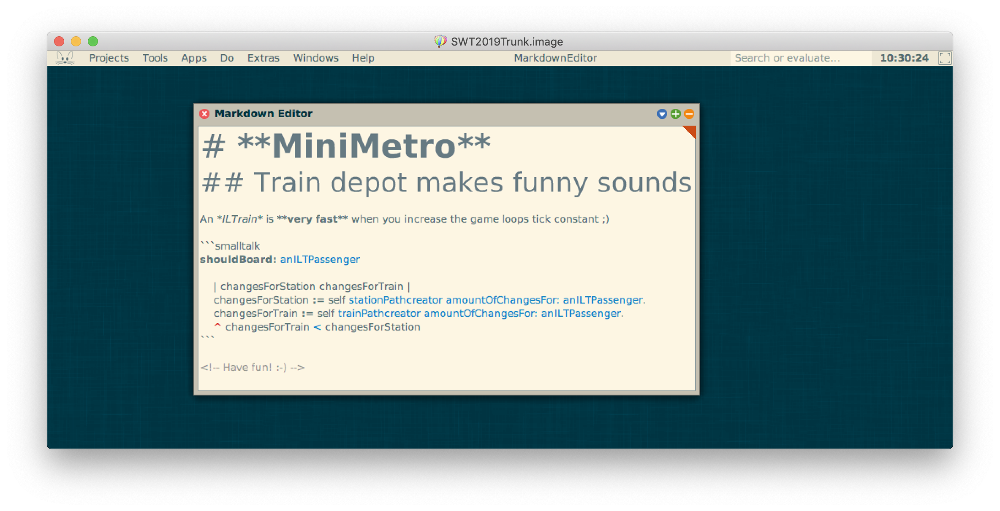
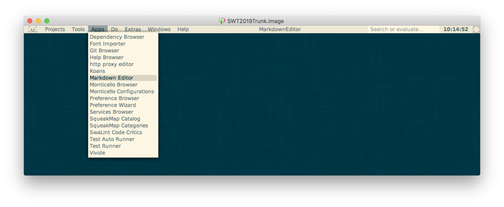

# MarkdownEditor

[![CI-Test][github_actions_test_badge]][github_actions_url]
[![CI-Lint][github_actions_lint_badge]][github_actions_url]
[![Coverage Status][coveralls_badge]][coveralls_url]

**MarkdownEditor** is a tool enabling Squeak users to write Markdown in Squeak with highlighting. The Editor is designed to *focus on the Markdown you write*, no other distractions.



## Features

The editor works like a normal workspace, but highlights the Markdown as you type. You can save the text as usual and also copy into and from the window.  
It is by no means feature complete. But the aspects we included, are conforming to the [Commonmark Spec Version 0.3](https://spec.commonmark.org/0.30/) ([with Github flavoured additions](https://github.github.com/gfm/)). 

- [x] Realtime syntax highlighting
- [x] ATX-Headings
- [x] Bold, Italics & Strikethrough
- [x] Smalltalk code blocks
- [x] Unordered lists
- [x] Ordered lists
- [x] URLs
- [x] Blockquotes
- [x] Images
- [x] Thematic Breaks
- [x] Rightclick Menu for Feature Exploration
- [x] Document Outline Tree
- [x] Custom visualization options

## How To Install

You can install the **MarkdownEditor** by opening any text field, pasting the following snippet and execute a *Do-It*:

```smalltalk
Installer mc
  http: 'https://github.com/hpi-swa-teaching/MarkdownEditor/releases/latest';
  install: 'MarkdownEditor'.
```

Alternatively, if you have Metacello installed in your Squeak-Image, you can install the **MarkdownEditor** with:

```smalltalk
Metacello new
	baseline: 'MarkdownEditor';
	repository: 'github://hpi-swa-teaching/MarkdownEditor:master/packages';
	load
```

After that, you can open the Editor via the *"App"*-menu:



## Contributing

During development, we set up some guidelines for coding. If you want to contribute, please have a look at [CONTRIBUTING.md](CONTRIBUTING.md).

## History

This is a project developed for the Software Engineering course, started during summer term 2019 - continued during
summer term 2020 and 2021.  
Developers: Julian Egbert, Marie Fischer, Felix Gohla, Kira Grammel, Clara Granzow, Conrad Halle, Judith Herrmann, Maximilian Kleissl, Henok Lachmann, Lucas Liebe, Jonas Kordt, Lara Pfennigschmidt, Martin Schilling, Finn Schöllkopf, Jakob Stigloher, Adrian Ziupka.  
When continuing this project, please feel free to add your names to the list. 😊

<!-- References -->
[coveralls_badge]: https://coveralls.io/repos/github/hpi-swa-teaching/MarkdownEditor/badge.svg?branch=master
[coveralls_url]: https://coveralls.io/github/hpi-swa-teaching/MarkdownEditor
[github_actions_test_badge]: https://github.com/hpi-swa-teaching/MarkdownEditor/workflows/CI-Test/badge.svg?branch=master
[github_actions_lint_badge]: https://github.com/hpi-swa-teaching/MarkdownEditor/workflows/CI-Lint/badge.svg?branch=master
[github_actions_url]: https://github.com/hpi-swa-teaching/MarkdownEditor/actions
