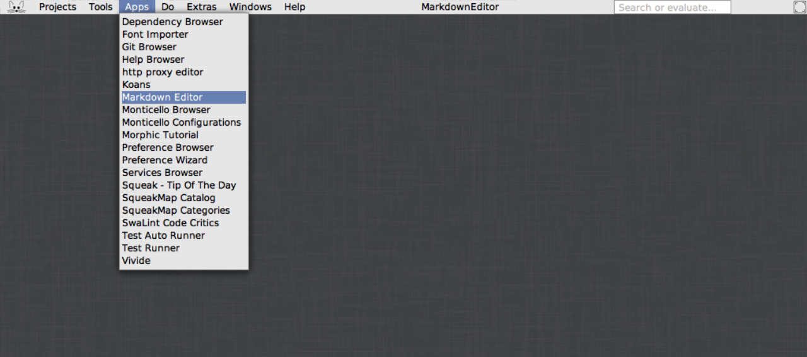

# MarkdownEditor [![Build Status][travis_badge]][travis_url] [![Coverage Status][coveralls_badge]][coveralls_url]

**MarkdownEditor** is a tool enabling Squeak users to write Markdown in Squeak with highlighting. The Editor is designed to *focus on the Markdown you write*, no other distractions.


## Features

The editor works like a normal workspace, but highlights the Markdown as you type. You can save the text as usual and also copy into and from the window.  
It is by no means feature complete. But the aspects we included, are conforming to the [Github Flavored Markdown Specification](https://github.github.com/gfm/). 

- [x] Realtime syntax highlighting
- [x] ATX-Headings
- [x] Bold & Italics
- [x] Smalltalk code blocks
- [x] HTML comment blocks
- [ ] Lists
- [ ] URLs
- [ ] Images
- [ ] Highlight escaped characters

## How To Install
You can install the **MarkdownEditor** by opening any text field, pasting the following snippet and execute a *Do-It*:

```smalltalk
Metacello new
	baseline: 'MarkdownEditor';
	repository: 'github://hpi-swa-teaching/MarkdownEditor:master/packages';
	load
```

After that, you can open the Editor via the *"App"*-menu:  


## Contributing
During development, we set up some guidelines for coding. If you want to contribute, please have a look at [CONTRIBUTING.md](CONTRIBUTING.md).

## History
This is a project developed for the Software Engineering course, started during summer term 2019.  
Developers: Felix Gohla, Kira Grammel, Jonas Kordt, Lara Pfennigschmidt, Jakob Stigloher
When continuing this project, please feel free to add your names to the list. 😊

<!-- References -->
[travis_badge]: https://travis-ci.org/hpi-swa-teaching/MarkdownEditor.svg?branch=master
[travis_url]: https://travis-ci.org/hpi-swa-teaching/MarkdownEditor
[coveralls_badge]: https://coveralls.io/repos/github/hpi-swa-teaching/MarkdownEditor/badge.svg?branch=master
[coveralls_url]: https://coveralls.io/github/hpi-swa-teaching/MarkdownEditor
